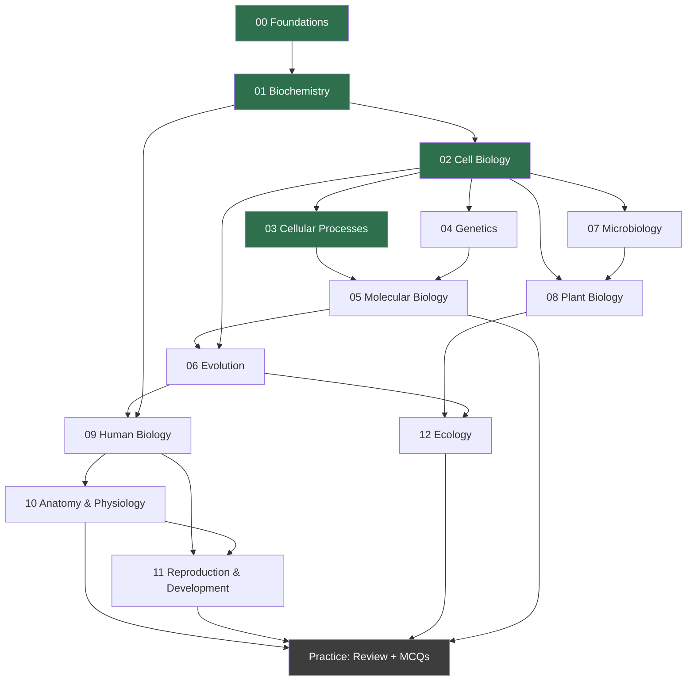

# Roadmap

Dependency order for the curriculum. Each section assumes the ones above it, so the arrow direction is the study order.

## Status legend

| Marker | Meaning |
| --- | --- |
| `[x]` | Written and reviewed |
| `[~]` | In progress |
| `[ ]` | Planned |

---

## Progress

### 00 — Foundations `[x]`

Prerequisite for everything else.

- [x] [Characteristics of life](00-foundations/01-characteristics-of-life.md)
- [x] [Biological organization](00-foundations/02-biological-organization.md)
- [x] [Atoms and elements](00-foundations/03-atoms-and-elements.md)
- [x] [Chemical bonds](00-foundations/04-chemical-bonds.md)
- [x] [Water](00-foundations/05-water.md)
- [x] [Acids, bases, and pH](00-foundations/06-acids-bases-and-ph.md)
- [x] [Prokaryotic and eukaryotic cells](00-foundations/07-cells-prokaryotes-and-eukaryotes.md)
- [x] [Taxonomy and classification](00-foundations/08-taxonomy-and-classification.md)
- [x] [Homeostasis](00-foundations/09-homeostasis.md)

### 01 — Biochemistry `[x]`

Requires: chemical bonds, water, pH.

- [x] [Carbohydrates](01-biochemistry/01-carbohydrates.md)
- [x] [Lipids](01-biochemistry/02-lipids.md)
- [x] [Proteins](01-biochemistry/03-proteins.md)
- [x] [Nucleic acids](01-biochemistry/04-nucleic-acids.md)
- [x] [Enzymes](01-biochemistry/05-enzymes.md)

### 02 — Cell Biology `[x]`

Requires: biochemistry, prokaryote vs eukaryote distinction.

- [x] [Cell theory and cell types](02-cell-biology/01-cell-theory-and-cell-types.md)
- [x] [Plasma membrane and the nucleus](02-cell-biology/02-plasma-membrane-and-nucleus.md)
- [x] [Protein synthesis and trafficking organelles](02-cell-biology/03-protein-synthesis-and-trafficking-organelles.md) (ribosome, RER, SER, Golgi, lysosome, peroxisome)
- [x] [Energy and containment organelles](02-cell-biology/04-energy-and-containment-organelles.md) (mitochondria, chloroplasts)
- [x] [Structure and movement](02-cell-biology/05-structure-and-movement.md) (cytoskeleton, centrosome, vacuoles, cilia, flagella)
- [x] [Comparison tables](02-cell-biology/06-comparison-tables.md): prokaryote vs eukaryote, plant vs animal, organelle summary

### 03 — Cellular Processes `[x]`

Requires: membranes, organelles, enzymes.

- [x] [Membrane structure and the fluid mosaic model](03-cellular-processes/01-membrane-structure-and-fluid-mosaic.md)
- [x] [Passive transport](03-cellular-processes/02-passive-transport.md): diffusion, facilitated diffusion, osmosis, tonicity
- [x] [Active transport](03-cellular-processes/03-active-transport.md): pumps, cotransport, endocytosis, exocytosis
- [x] [ATP and metabolism](03-cellular-processes/04-atp-and-metabolism.md)
- [x] [Glycolysis](03-cellular-processes/05-glycolysis.md)
- [x] [Pyruvate oxidation and the citric acid cycle](03-cellular-processes/06-pyruvate-oxidation-and-citric-acid-cycle.md)
- [x] [The electron transport chain and ATP synthase](03-cellular-processes/07-electron-transport-chain-and-atp-synthase.md)
- [x] [Fermentation](03-cellular-processes/08-fermentation.md)
- [x] [Photosynthesis](03-cellular-processes/09-photosynthesis.md)
- [x] [The cell cycle and its checkpoints](03-cellular-processes/10-cell-cycle-and-checkpoints.md)
- [x] [Mitosis and cytokinesis](03-cellular-processes/11-mitosis-and-cytokinesis.md)
- [x] [Meiosis](03-cellular-processes/12-meiosis.md)
- [x] [Mitosis vs meiosis](03-cellular-processes/13-mitosis-vs-meiosis.md)

### 04 — Genetics `[ ]`

Requires: chromosomes, cell division. *Next.*

- [ ] Genes, alleles, genotype, phenotype
- [ ] Mendelian inheritance and Punnett squares
- [ ] Non-Mendelian patterns: incomplete dominance, codominance, multiple alleles, sex linkage
- [ ] Pedigree analysis
- [ ] Human inheritance patterns

### 05 — Molecular Biology `[ ]`

Requires: genetics, nucleic acids, protein structure.

- [ ] DNA structure
- [ ] DNA replication
- [ ] RNA and its three types
- [ ] Transcription
- [ ] Translation and the genetic code
- [ ] Gene regulation
- [ ] Mutations

### 06 — Evolution `[ ]`

Requires: genetics, molecular biology.

- [ ] Variation, fitness, adaptation
- [ ] Natural selection
- [ ] Genetic drift and gene flow
- [ ] Speciation
- [ ] Evidence for evolution and common ancestry

### 07 — Microbiology `[ ]`

Requires: cell biology, nucleic acids.

- [ ] Bacterial structure and physiology
- [ ] Archaea
- [ ] Viruses
- [ ] Fungi and protozoa
- [ ] Microbial reproduction and transmission
- [ ] Host–pathogen interaction
- [ ] Beneficial microorganisms
- [ ] Comparison tables

### 08 — Plant Biology `[ ]`

Requires: cell biology, membranes.

- [ ] Plant cells and tissues
- [ ] Roots, stems, leaves
- [ ] Xylem and phloem
- [ ] Water transport and transpiration
- [ ] Plant hormones
- [ ] Plant reproduction and alternation of generations

### 09 — Human Biology `[ ]`

Requires: foundations, homeostasis.

- [ ] The four tissue types
- [ ] Organs and organ systems
- [ ] **Homeostasis — the full control loop** (receptor → control center → effector → response)

### 10 — Anatomy & Physiology `[ ]`

Requires: human biology, biochemistry.

- [ ] Skeletal · [ ] Muscular · [ ] Nervous · [ ] Endocrine · [ ] Cardiovascular
- [ ] Respiratory · [ ] Digestive · [ ] Urinary · [ ] Immune · [ ] Reproductive

Each system follows: structure → function → mechanism → regulation → homeostasis.

### 11 — Reproduction & Development `[ ]`

Requires: cell division, genetics, endocrine.

- [ ] Spermatogenesis and oogenesis
- [ ] Fertilization and the zygote
- [ ] Early development and cleavage
- [ ] Differentiation and tissue formation
- [ ] Placenta and maternal–fetal exchange

### 12 — Ecology `[ ]`

Requires: cell biology, evolution.

- [ ] Levels of organization
- [ ] Food chains, food webs, energy flow, trophic levels
- [ ] Nutrient cycles
- [ ] Population growth
- [ ] Ecological relationships
- [ ] Biodiversity

### Practice `[x]` (bank 1 of 2)

- [x] [Practice README](practice/README.md)
- [x] [Foundations and biochemistry MCQs](practice/01-foundations-and-biochemistry-mcq.md)
- [x] [High-yield distinctions](practice/high-yield-distinctions.md)
- [x] [Common confusions](practice/common-confusions.md)
- [ ] Section-by-section cumulative banks for 02–12
- [ ] Full-length mixed exam

---

## Build order rationale

Two things drive the order:

1. **Mechanisms before nomenclature.** Cell biology comes before molecular biology because "rough ER" is a name and "vesicle budding from the ER because a protein was misfolded" is a mechanism. A student who learns the mechanism first does not need to memorize the name.
2. **Foundations earn their size.** Sections 00 and 01 are the longest chapters in the curriculum and contain the most practice questions, because everything downstream assumes them. Weak chemistry is the single most common reason a pre-med student struggles with physiology later.

**Prerequisite crossings worth knowing:** genetics and molecular biology both need cell division, so meiosis (03) precedes meiosis-as-genetics (04). Microbiology and plant biology both need membranes and organelles, so they come after cell biology but before human biology — comparative structure in non-human organisms makes the human system easier to hold onto.